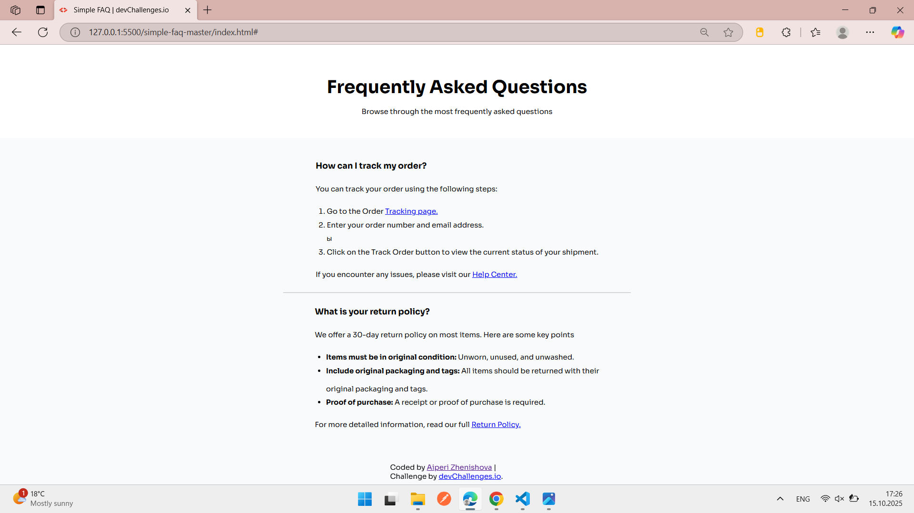

<!-- Please update value in the {}  -->

<h1 align="center">{Simple FAQ Page} | devChallenges</h1>

   Solution for a challenge <a href="https://devchallenges.io/challenge/simple-faq-challenge" target="_blank">Simple FAQ</a> from <a href="http://devchallenges.io" target="_blank">devChallenges.io</a>.

  <h3>
    <a href="{https://aiperizhenishova.github.io/simple-faq-page/}">
      Demo
    </a>
     | 
    <a href="{https://github.com/aiperizhenishova/simple-faq-page.git}">
      Solution
    </a>
     | 
    <a href="https://devchallenges.io/challenge/simple-faq-challenge">
      Challenge
    </a>
  </h3>

<!-- TABLE OF CONTENTS -->

## Table of Contents

- [Overview](#overview)
  - [What I learned](#what-i-learned)
  - [Useful resources](#useful-resources)
- [Built with](#built-with)
- [Features](#features)
- [Contact](#contact)
- [Acknowledgements](#acknowledgements)

<!-- OVERVIEW -->

## Overview

<!--
Introduce your projects by taking a screenshot or a gif. Try to tell visitors a story about your project by answering:

- What have you learned/improved?
- Your wisdom? :)
-->

### What I learned

- Built a FAQ page with collapsible answers
- Practiced using Flexbox and Grid
- Made the page responsive for desktop, tablet, and mobile

### Useful resources

- [MDN Flexbox](https://developer.mozilla.org/en-US/docs/Web/CSS/CSS_Flexible_Box_Layout) — helped with layout
- [CSS Tricks Grid](https://css-tricks.com/snippets/css/complete-guide-grid/) — helped with grid setup

### Built with

<!-- This section should list any major frameworks that you built your project using. Here are a few examples.-->

- Semantic HTML5 markup
- CSS custom properties
- Flexbox
- CSS Grid
- [React](https://reactjs.org/)
- [Vue.js](https://vuejs.org/)
- [Tailwind](https://tailwindcss.com/)

## Features

- Collapsible FAQ answers
- Responsive design (desktop, tablet, mobile)
- Clean and simple layout

This application/site was created as a submission to a [DevChallenges](https://devchallenges.io/challenges-dashboard) challenge.

## Acknowledgements

<!-- This section should list any articles or add-ons/plugins that helps you to complete the project. This is optional but it will help you in the future. For exmpale -->

## Author

- Demo [Live Site](https://aiperizhenishova.github.io/simple-faq-page/)
- GitHub [@aiperizhenishova](https://github.com/aiperizhenishova/simple-faq-page)
